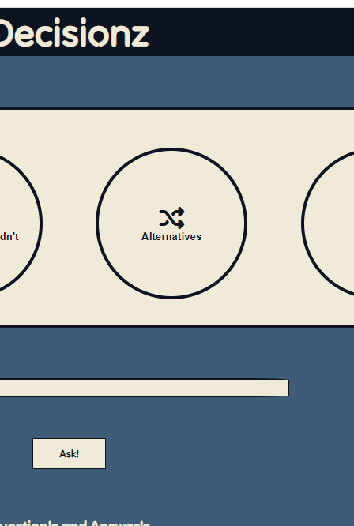

# Decisionz

Have you ever had a hard time making an easy decision, maybe what you want to eat for dinner, what you want to do first in your todolist or just wanna have someone else decide if you are going to do that not so necessary thing you thought about doing. Then you should visit [Decisionz](https://bigkaboon.github.io/Decisionz/).

The application can help you in four different ways, the first two is simular yes or no- and should or shouldn't questions, they are easy to use and the answeres are clear. The other two types is scalee and alternatives. This makes it possible for you to to add in alternatives and get a random one as response, The scale is exactly what it sounds like. It gives you a scale on a question you provide with a scale of your choice.


## Features

  ---

  - **Yes/No** - This feature let the user ask a question in the input field and get one of the answers as response.
  
    
 
  - **Should/Shouldn't** - Very alike the yes/no feature except the answers are different whitch indicates that the user should phrase the question differently
- 
    

  
  - **Alternatives** - The alternative feature firstly requier the user to choose how many alternatives they would like, once completed, the user is asked to fill in all the alternatives so that a random alternative can be provided as response.


    
  
  - **Scale** - This feature lets the user pick between three different scales 1-10, 1-100 and 1-1000 and then write the question/statement the user want to see a scale on.
  
    
  
  - **Display QnA** - In the white bordered box located just below the "Ask!" button all the questions and answeres gets saved one by one in the order you ask them whitch makes it possible for the user to go back and use the output provided by the application.
  
  

  - **Email results** - Once you are finished asking your questions and are satisfied of what is displayed in the  QnA-box you can send the content to your email simply by filling in the form whitch appears once "Result on Email" button is clicked.


  


## Features Left to Implement
---
  - **Response** - With more time I would make the reponse more advanced, an idea to this is answering by using the question. One way to accomplish this would be instead of simply yes or no you could involve the question asked. Let's say the question is "Am I going to sleep good tonight". Then make a function that removes "Am", replace "I" to "you are" (if answer is yes) or "you are not" (if answer is no)  and then answer the question so the output would be "yes you are going to sleep good tonight". This wont probably work for all the questions asked but it would be a cool feature to add.

## Validator Testing

## Unfixed bugs

## Deployment
- I deployed the site to GitHub pages, the process is described by the steps below.
  * Open the repository and click settings.
  * Click pages on the side bar to the left.
  * inside pages select main branch and and root folder.
  * Once complete press save and deployed version is up and running within a few minuits.
## Credits
-**Icons** - The icons I used is from google [FontAwesome](https://fontawesome.com/)

- **Love Math** - The planning of the area where you choose what type of question you would like to use is well insperated from the Love Math walk through project, I added the buttons in a div in the same way as in the project but edited code so that the logistics matched the purpuse of my project since they work a bit differently.
  
- **Mentor** - I had some issues getting the Email feature to work so I asked my mentor for help to get the functionality behind it to work. I got help with this code provided below. 

```
const sendEmail = (userName, userMail) => {
    emailjs.send('service_5zj8vt1', 'template_sc6pd6m', { name: userName, email: userMail, answers: document.getElementById("QnA-list").innerText }, 'd8LxiloK_bJZiS78E')
        .then((result) => {
            console.log(result.text);
        }, (error) => {
            console.log(error.text);
        });
};
document.getElementById('close-btn').addEventListener('click', function (event) {
    document.getElementById('sendEmail').classList.add('hide');
});

document.getElementById('send').addEventListener('click', (event) => {
    const userName = document.getElementById("user_name").value;
    const userMail = document.getElementById("user_email").value;
    sendEmail(userName, userMail);
    document.getElementById('sendEmail').classList.add('hide');

});

```

- **EmailJS** - I used [EmailJS](https://www.emailjs.com/) to send the results via email.
## Media
- No media used.
